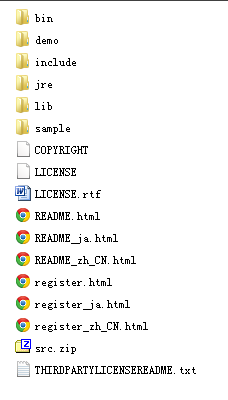

Java Presentation

2012/08 Allen

---
起源
===

- Java来自于Sun公司的一个叫Green的项目，其原先的目的是为家用消费电子产品开发一个分布式代码系统，这样我们可以把E-mail发给电冰箱、电视机等家用电器，对它们进行控制，和它们进行信息交流。开始，准备采用C++,但C++太复杂，安全性差，最后基于C++开发一种新的语言Oak(Java的前身)，Oak是一种用于网络的精巧而安全的语言，Sun公司曾依此投标一个交互式电视项目，但结果是被SGI打败。可怜的Oak几乎无家可归，恰巧这时MarkArdreesen开发的Mosaic和Netscape启发了Oak项目组成员，他们用Java编制了HotJava浏览器，得到了Sun公司首席执行官ScottMcNealy的支持，触发了Java进军Internet。
- Java语言正式问世被美国著名杂志PC Magazine评为1995年十大优秀科技产品之一
- JDK 1.2在1998年12月4日的隆重发布，标志着Java2平台的诞生
- 1999年Sun公司还将Java 2平台分为三大块:J2SE，*J2EE*，J2ME 
- 2009年4月，Oracle公司以每股9.5美元的价格收购Sun，交易总值将超过70亿美元,Java被Oracle掌控。 

---
特点
===

- 由美国SUN微系统公司(Sun Microsystems, Inc.)所研究而成的语言 
- 为 Internet发展的计算机语言 
- 使网页(Web Page)产生生动活泼画面的语言 
- 使网页(Web Page)由静态(Static)转变为动态(Dynamic)的语言 
- 简化的C++语言，是一种安全的语言，具有阻绝计算机病毒传输的功能
- 将安全性(Security)列为第一优先考虑的语言 
- 是一种「写一次，即可在任何机器上执行(Write Once Run Anywhere)」的语言
- 第一套允许使用者将应用程序(Applications)通过Internet从远端的服务器(Remote Server)传 输到本地端的机器上(LocalMachine)并执行的语言 
- 应用程序提供者不需要知道使用者的计算机硬件(如：Sun, Intel, 或MAC等)与软件(如：SW- UNIX, MAC O/S, Windows, 或NT等)环境的语言(Kestenbaum, 1995)。 

---

公司与组织
====
- Sun
- IBM
- BEA
- Oracle
- Apache
- JBoss
- TheServerSide 
- Borland
- JCP
- MicroSoft: 催生 .NET

---

现状
===

2012年8月TIOBE排行榜

---
Java2
===
Java2 Platform

---

JDK目录结构
===========

---

JDK实用工具
===========
- javac：Java编译器，将Java源代码编译为字节码；
- java：Java解释器，用来解释执行Java程序的字节码文件；
- appletviewer(小程序浏览器)：一种执行HTML文件上的Java小程序类的Java浏览器；
- javadoc：根据Java源代码及其说明语句生成的HTML文档；
- jdb：Java调试器，可以逐行地执行程序、设置断点和检查变量；
- javah：产生可以调用Java过程的C过程，或建立能被Java程序调用的C过程的头文件；
- javap：Java反汇编器，显示编译类文件中的可访问功能和数据，同时显示字节代码含义。

---
基础知识
===
类(Java设计从类设计开始)
------
在面向对象的编程语言中，类是一个独立的程序单位，是具有相同属性和方法的一组对象的集合。
描述一个类需要指明下述三个方面内容：

- 类标识：类的一个有别于其他类的名字。
- 属性说明：用来描述相同对象的静态特征。
- 方法说明：用来描述相同对象的动态特征。

所有的类都是java.lang.Object的子类

对象
-------
所有的Java对象都是通过new关键生成

对象是类的实例

---

基础知识
===
封装 wrap
-------
隐藏对象的属性和实现细节，仅对外公开接口方法,控制在程序中属性的读和修改的访问级别

- 把尽可能多的东西藏起来.对外提供简捷的接口.
- 把所有的属性藏起来.

继承 inheritance
-------
子类共享父类中定义的数据和方法，Java只支持单继承

- 使软件系统具有开放性
- 更好地进行抽象与分类
- 实现代码的复用
- 提高可维护性

---

基础知识
===
多态 polymorphism
------
多态是类具有表现多种形态的能力的特征，在OO中是指语言具有根据对象的类型以不同方式处理之，特别是重载方法和继承类这种形式的能力

    !java
    Animal a1 = new Elephant();
    Animal a2 = new Bird();
    a1.getLegs();  // 4
    a2.getLegs();  // 2  

重载 overload
-------
- 方法名相同，参数不同
- 方法名相同，参数个数不同

---

基础知识
===
抽象类 abstract class
-------
- 无法实例化
- 可定义抽象的方法，可以实现
- 抽象的方法由继承extend该类的子类实现

接口 interface
--------
- 无法实例化
- 只能定义公有的方法，不能实现
- 一个类可以同时实现implements多个接口

*接口与抽象类定义了对象的行为模型，相当于一个协议，有利于对外提供服务。*

---

基础知识
===
八种基本类型(非面向对象部分)
------
- char
- byte
- short
- int
- long
- float
- double
- boolean

引用类型
-------
- class
- array

---
基础知识
===
包 package
----------
默认的包为java.lang

- 组织代码结构
- 访问控制

> eg: com.ztesec.impress

对象的初始化
----------
初始化顺序

1. 父类的静态成员
2. 子类的静态成员
3. 父类的构造函数
4. 子类的构造函数

---

基础知识
====
- 操作符: + - * / 
- 位运算: >>,<<,>>>，&, | 
- 访问控制: package,private,protect,public
- 逻辑运行: if-else,for,do-while,switch ("goto")
- static
- final
- try-catch-finally
- Exception handler

---

基础知识
====
源文件 
------
    !java
    public class HelloWorld{
        public static main(String[] args){            
            System.out.println("Hello World!");
        }
    }

[编程规范](java-simple-codestyle.html)

编译
-------
    !sh
    javac HelloWorld.java

运行
-------
    !sh
    java HelloWorld

    Hello World!

---

基础总结
======

- Java中一切都是对象
- 通过引用来维护对象
- 代码运行在虚拟机之上
- 内存不需要自己维护

---

java.util.*
==========
- List:ArrayList
- LinkedList
- Iterator
- Stack
- Set: HashSet,TreeSet
- Map: HashMap,LinkedHashMap,TreeMap
- Queue

---

java.util.List
==========

---

String
==========
    !java
    String str = "hello world!";
    String str1 = new String("hello world!");

字符串连接
---------
    !java
    String s = "abc";
    s = "123" + s + "suspend";    //"123abcsuspend"

StringBuilder
------------

StringBuffer
------------

---
Eclipse
====

